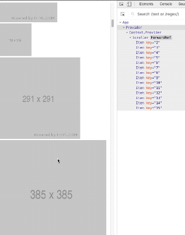
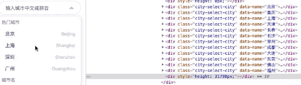
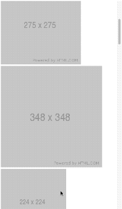
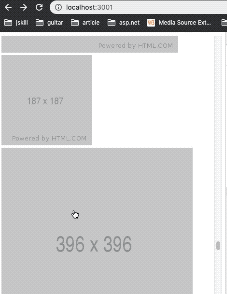

## React-Roll
#### infinite scroller, record scroll position, like twitter's timeline

## DEMO

### different height items


### select city of china


### infinite scroll to load data


### record scroll status


## Usage

### * Quick use!

``` javascript
import {Provider, Scroller} from 'react-roll'

const App () => (
  <Provider>
    <Scroller element={ListItem}/>
  </Provider>
)
```

### * How list items get data？

``` javascript
async function fetch(page, push) {
  const list = await getData({page}) // list: [{title}]
  push(list)
}

const ListItem = ({title}) => <div>{title}</div>

// As long as there is onFetch prop, that you can infinite load list data
<Provider>
  <Scroller element={ListItem} onFetch={fetch} />
</Provider>
```

### * Make scrolling more perfect

``` javascript

// If the list items have different heights, set an average height!
// And If the list items have same heights, set an average height too!
<Provider>
  <Scroller averageHeight={200} element={ListItem} onFetch={fetch} />
</Provider>

```

### * No need to scroll infinitely, just optimize the list

``` javascript

<Provider source={bigList}>
  <Scroller averageHeight={50} element={ListItem}>
</Provider>

```

### * Insert elements other than lists

``` javascript

<Provider source={bigList}>
  <Scroller
    {/* other elements */}
    upperRender={() => <Header />}
    averageHeight={50}
    element={ListItem}>
</Provider>

```

## API

### Scroller

| prop(extends DIV) | description                                                                     | type          | default |
| :---------------- | ------------------------------------------------------------------------------- | ------------- | ------: |
| element           | list item component                                                             | React.Element |
| averageHeight     | average height of list item                                                     | Number        |     350 |
| length            | The actual number to render, If not set, it will be calculated by the algorithm | Number        |
| onFetch           | the method of fetch data                                                        | Function      |
| upperRender       | insert elements other than lists                                                | Function      |

### Provider

| prop   | description                                     | type  | default |
| :----- | ----------------------------------------------- | ----- | ------: |
| source | List data, make scrolling components controlled | Array |
