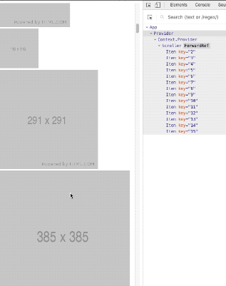
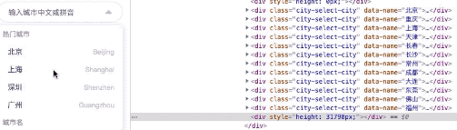
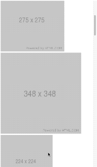
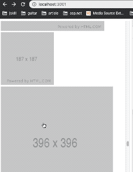

## React-Roll
#### 无限滚动, 保持滚动状态, 和推特的时间轴一样

<a href="https://github.com/fagougou/react-roll">🇦🇺 English</a>
| 🇨🇳 简体中文

## 特性

- 优化长列表渲染
- 无限滚动加载
- 记录列表滚动状态
- 支持不同高度的列表项目

## 例子

### 不同高度的列表项



### 中国城市选择器


### 无限滚动加载数据


### 记录滚动状态，返回复原


## 安装

```
npm install react-scoll
```

## 使用

### * 快速使用！

``` javascript
import {Provider, Scroller} from 'react-scoll'

const App () => (
  <Provider>
    <Scroller element={ListItem}/>
  </Provider>
)
```

### * 如何把数据传个每个列表项？

``` javascript
async function fetch(page, push) {
  const list = await getData({page}) // list: [{title}]
  push(list)
}

const ListItem = ({title}) => <div>{title}</div>

// 只要有onFetch属性，就可以无限加载列表数据
<Provider>
  <Scroller element={ListItem} onFetch={fetch} />
</Provider>
```

### * 使滚动更精确

``` javascript

// 如果列表项的高度不同，请设置平均高度！
// 如果列表项的高度相同，也要设置平均高度！
<Provider>
  <Scroller averageHeight={200} element={ListItem} onFetch={fetch} />
</Provider>

```

### * 无需无限滚动，只需优化列表

``` javascript

<Provider source={bigList}>
  <Scroller averageHeight={50} element={ListItem}>
</Provider>

```

### * 插入列表以外的元素

``` javascript

<Provider source={bigList}>
  <Scroller
    {/* 其他元素 */}
    upperRender={() => <Header />}
    averageHeight={50}
    element={ListItem}>
</Provider>

```

## API

### Scroller

| 属性(扩展div元素) | 说明                                             | 类型          | 默认值 |
| :---------------- | ------------------------------------------------ | ------------- | -----: |
| element           | 列表项目组件                                     | React.Element |
| averageHeight     | 列表项目平均高度                                 | Number        |    350 |
| length            | 真实渲染的项目个数，如果未设置，则由算法计算得到 | Number        |
| onFetch           | 获取数据的方法                                   | Function      |
| upperRender       | 插入列表以外的元素                               | Function      |

### Provider

| 属性   | 说明                         | 类型  | 默认值 |
| :----- | ---------------------------- | ----- | -----: |
| source | 列表数据，使滚动组件受到控制 | Array |